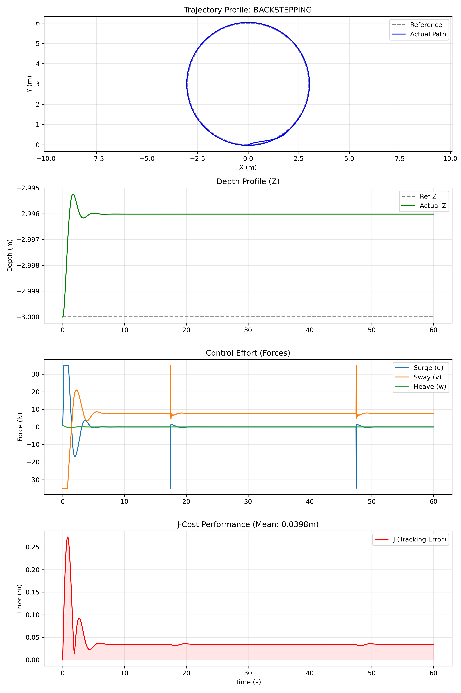
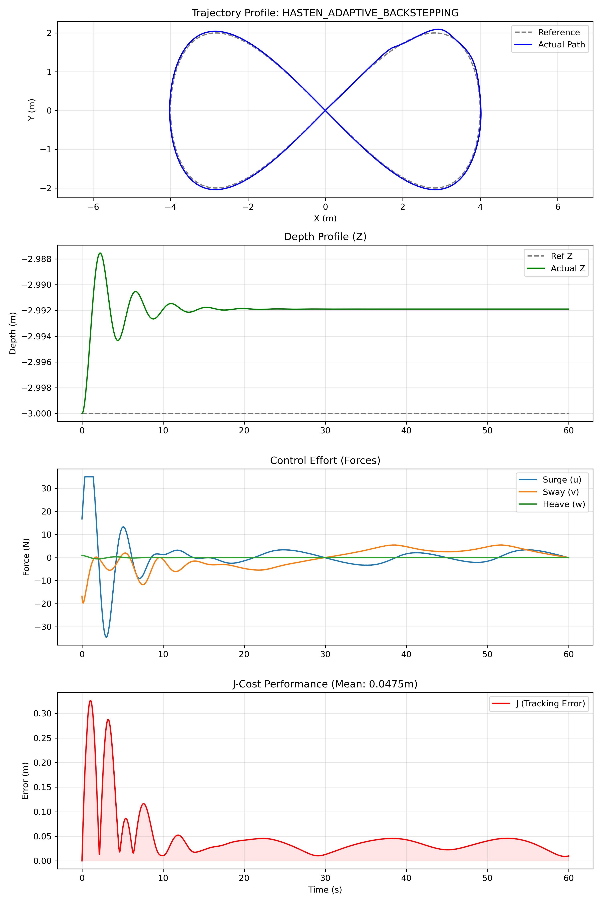
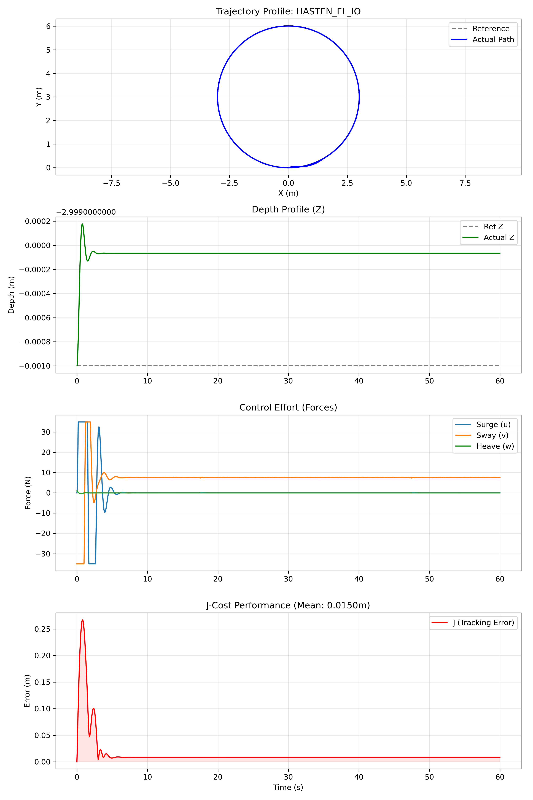
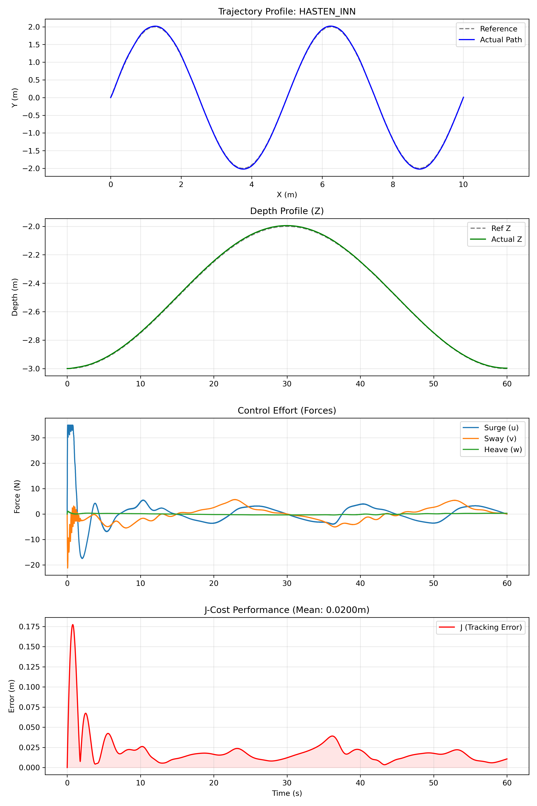

# Mathematical Modeling & Controller Design for a BlueROV2-Inspired 4-DOF Underwater Vehicle

> **HASTEN-AUV** — Haptic-shared Adaptive conSol Tracking for Experimental Navigation of Autonomous Underwater Vehicles

A comprehensive ROS 2 + Gazebo Harmonic simulation framework implementing and benchmarking **7 nonlinear control architectures** for a 4-DOF BlueROV2-inspired AUV.

[](https://docs.ros.org/en/humble/)
[](https://gazebosim.org/docs/harmonic/getstarted/)
[](https://www.python.org/)
[](https://www.docker.com/)
[](LICENSE)

---

## 🎬 Simulation Videos

All controllers were validated in **Gazebo Harmonic** simulation on three standard trajectories (Circle, Figure-8 / Lemniscate, and 3D Spline). Full recordings are available in the [`Simulation_Videos/`](./Simulation_Videos/) folder.

| Controller | Trajectory | Video |
|---|---|---|
| State Feedback | Circle | [`State_feedback_circle.webm`](Simulation_Videos/State_feedback_Controller_circular_trajectory_tracking.webm) |
| State Observer | Spline | [`State_observer_spline.webm`](Simulation_Videos/State_Observer_Controller_spline_Trajectory_Tracking.webm) |
| FL Input | Infinity | [`FL_input_infinity.webm`](Simulation_Videos/FeedbackLinearization_input_controller_infinity_path_tracking.webm) |
| FL I/O | Circle | [`FL_io_circle.webm`](Simulation_Videos/Feedback_linearization_inputoutput_Controller_circular_trajectory_tracking.webm) |
| MRAC | 3D Spline | [`MRAC_spline.webm`](Simulation_Videos/MRAC_3d_spline_trajectoryTracking.webm) |
| Adaptive Backstepping | Infinity (∞) | [`AdaptiveBS_infinity.webm`](Simulation_Videos/Adaptive_BackStepping_Controller_infinty_trajectory_Tracking.webm) |
| Adaptive INN | Circle | [`INN_circle.webm`](Simulation_Videos/INN_circular_trajectory_tracking.webm) |

---

## 📋 Overview

HASTEN-AUV integrates **Gazebo Harmonic** physics simulation with a **ROS 2 Humble** control stack, enabling reproducible, publication-quality benchmarking of nonlinear AUV controllers. The project supports both software-in-the-loop (SITL) development via Docker Dev Containers and future real-hardware deployment through MAVROS.

**Key research contributions:**
- Mathematical modeling of BlueROV2-inspired 4-DOF AUV (Fossen's formulation)
- Comparative evaluation of 7 nonlinear controllers across 3 trajectory types
- Online backpropagation-trained **Inverse Neural Network (INN)** controller
- **Haptic shared-control** architecture for human-in-the-loop teleoperation
- Ocean current disturbance injection (Dryden model) for robustness testing

---

## 🏗️ System Architecture

```
┌─────────────────────────────────────────────────────────┐
│                    Simulation Layer                       │
│   Gazebo Harmonic │ BlueROV2 URDF/SDF │ Ocean Current   │
└──────────────────────────┬──────────────────────────────┘
                           │ ROS 2 Topics / Services
┌──────────────────────────▼──────────────────────────────┐
│                  ROS 2 Middleware Layer                   │
│  Mission GUI │ Controller Node │ Observer │ Data Logger  │
└──────────────────────────┬──────────────────────────────┘
                           │ Control Law τ
┌──────────────────────────▼──────────────────────────────┐
│                 Control Algorithms Layer                  │
│  State FB │ State Obs. │ FL-In │ FL-IO │ MRAC │ ABS │ INN │
└──────────────────────────┬──────────────────────────────┘
                           │ MAVROS (hardware only)
                    BlueROV2 / ArduSub
```


---

## ⚙️ Controller Suite

| # | Controller | Type | Description |
|---|---|---|---|
| 1 | **State Feedback** | Linear | Full-state LQR feedback; baseline reference |
| 2 | **State Observer** | Linear | Luenberger observer + state feedback |
| 3 | **FL (Input)** | Nonlinear | Input-space feedback linearization |
| 4 | **FL (I/O)** | Nonlinear | Input-output feedback linearization |
| 5 | **MRAC** | Adaptive | Model Reference Adaptive Control (MIT rule) |
| 6 | **Adaptive Backstepping** | Adaptive | Lyapunov-stable recursive backstepping with adaptation |
| 7 | **Adaptive INN** | Neural-Adaptive | Online backprop-trained Inverse Neural Network |

---

## 📊 Experimental Results

### Performance Metrics Summary

All metrics averaged across Circle, Figure-8, and 3D Spline trajectories:

| Controller | Pos RMSE (m) | Pos ITAE | Yaw RMSE (rad) | Yaw ITAE | Rank |
|---|:---:|:---:|:---:|:---:|:---:|
| **Backstepping** | **0.0364** | **40.57** | **0.0432** | **9.67** | 🥇 |
| **FL I/O** | **0.0278** | **10.76** | 0.0734 | 17.66 | 🥈 |
| Adaptive INN | 0.0393 | 41.31 | 0.0434 | 9.99 | 🥉 |
| Adapt. Backstepping | 0.0681 | 77.02 | 0.0911 | 3.60 | 4 |
| MRAC | 0.1317 | 120.62 | 0.8576 | 754.99 | 5 |
| State Observer | 0.1934 | 299.37 | 0.0950 | 88.18 | 6 |
| State Feedback | 0.2305 | 381.22 | 0.1530 | 6.32 | 7 |
| FL Input | 0.2878 | 570.62 | 1.5254 | 1658.5 | 8 |

> **Best overall**: Standard **Backstepping** controller achieved lowest RMSE on circle/figure-8 trajectories, while **FL I/O** excelled on precision tasks with lowest ITAE.

### Trajectory Tracking Figures

**Backstepping — Circle Trajectory**


**Adaptive Backstepping — Figure-8 (Lemniscate) Trajectory**


**FL I/O — Circle Trajectory**


**Adaptive INN — 3D Spline Trajectory**


---

## 📁 Repository Structure

```
bluerov2_control_project/
├── Simulation_Videos/           # ← Gazebo simulation recordings (webm)
│   ├── State_feedback_Controller_circular_trajectory_tracking.webm
│   ├── Adaptive_BackStepping_Controller_infinty_trajectory_Tracking.webm
│   ├── MRAC_3d_spline_trajectoryTracking.webm
│   ├── INN_circular_trajectory_tracking.webm
│   └── ...
├── ros2_ws/
│   └── src/
│       └── bluerov2_control/
│           ├── bluerov2_control/
│           │   ├── controller_node.py         # Main controller dispatcher
│           │   ├── state_observer_node.py     # Luenberger state observer
│           │   ├── ocean_current_node.py      # Dryden disturbance injection
│           │   ├── data_logger_node.py        # CSV trajectory logger
│           │   └── mission_control_gui.py     # Mission planner GUI
│           ├── controllers/
│           │   ├── state_feedback.py
│           │   ├── state_observer_linear.py
│           │   ├── fl_input.py
│           │   ├── fl_io.py
│           │   ├── mrac.py
│           │   ├── backstepping.py
│           │   ├── hasten_adaptive_backstepping.py
│           │   └── hasten_inn.py
│           └── launch/
│               └── bluerov2_control.launch.py
├── results/                     # CSV performance logs (all controller × trajectory)
│   └── metrics_summary.csv
├── figures/                     # Trajectory + error + torque plots (PNG)
├── docs/
│   ├── architecture.png
│   └── HASTEN_AUV.pdf
├── matlab/                      # MATLAB analysis scripts
├── notebooks/                   # Jupyter notebooks for data analysis
└── scripts/                     # Utility scripts
```

---

## 🚀 Quick Start

### Prerequisites

- Ubuntu 22.04 LTS
- [ROS 2 Humble](https://docs.ros.org/en/humble/Installation.html)
- [Gazebo Harmonic](https://gazebosim.org/docs/harmonic/install/)
- Python 3.10+
- Docker (optional, for Dev Container)

### 1. Clone & Build

```bash
git clone https://github.com/As0966/bluerov2_control_project.git
cd bluerov2_control_project
colcon build --symlink-install
source install/setup.bash
```

### 2. Launch Simulation

```bash
# Launch Gazebo + ROS 2 nodes
ros2 launch bluerov2_control bluerov2_control.launch.py

# In a second terminal: open Mission GUI
ros2 run bluerov2_control mission_control_gui
```

### 3. Run All Benchmarks

```bash
python3 scripts/run_all_benchmarks.py
# Logs saved to results/ as CSV files
# Plots saved to figures/ as PNG files
```

---

## 📐 Mathematical Model

The AUV dynamics follow **Fossen's (2011)** formulation for marine craft:

```
M·ν̇ + C(ν)·ν + D(ν)·ν + g(η) = τ_control + τ_disturbance
η̇ = J(η)·ν
```

Where:
- **η** = [x, y, z, ψ]ᵀ — position + yaw state
- **ν** = [u, v, w, r]ᵀ — body-frame velocity (surge, sway, heave, yaw)
- **M** = rigid-body + added mass inertia matrix
- **C(ν)** = Coriolis + centripetal matrix
- **D(ν)** = linear + quadratic drag matrix
- **g(η)** = gravitational/buoyancy vector

---

## 🌊 BlueROV2 Parameters

| Parameter | Symbol | Value | Unit |
|---|---|---|---|
| Mass | m | 11.4 | kg |
| Added mass (surge) | Xü | -5.5 | kg |
| Added mass (sway) | Yv̇ | -12.7 | kg |
| Added mass (heave) | Zẇ | -14.57 | kg |
| Added mass (yaw) | Nṙ | -0.12 | kg·m² |
| Linear drag (surge) | Xu | -4.03 | N·s/m |
| Linear drag (sway) | Yv | -6.22 | N·s/m |
| Buoyancy force | B | 112.8 | N |
| Gravity | W | 111.72 | N |

---

## 🗃️ Results Data

All raw CSV logs are in [`results/`](./results/):

```
results/
├── metrics_summary.csv                           # Aggregated RMSE/MSE/MAE/ITAE
├── backstepping_circle_gazebo.csv
├── backstepping_figure8_gazebo.csv
├── hasten_adaptive_backstepping_circle_gazebo.csv
├── hasten_fl_io_circle_gazebo.csv
├── hasten_inn_spline_gazebo.csv
├── hasten_mrac_spline_gazebo.csv
└── ...
```

Load and analyze in Python:
```python
import pandas as pd
df = pd.read_csv("results/metrics_summary.csv")
print(df.groupby("Controller")["Pos_RMSE"].mean().sort_values())
```

---

## 📜 Citation

If you use this work, please cite:

```bibtex
@mastersthesis{JankaHastenAUV2025,
  author    = {Bayisa Ligaba Janka},
  title     = {Haptic-Shared Adaptive Control for Autonomous Underwater Vehicles},
  school    = {İzmir Katip Çelebi University},
  year      = {2025},

}
```

---

## 👤 Author

**Bayisa Ligaba Janka**
- MSc Researcher — Robot Control
- İzmir Katip Çelebi University, Turkey
- [](https://orcid.org/0009-0009-0510-0944)
- [](https://github.com/As0966)
- [](https://as0966.github.io)

**Advisor:** Assoc. Prof. Kamil ÇETİN — İzmir Katip Çelebi University

---

## 📄 License

This project is licensed under the MIT License — see the [LICENSE](LICENSE) file for details.

---

