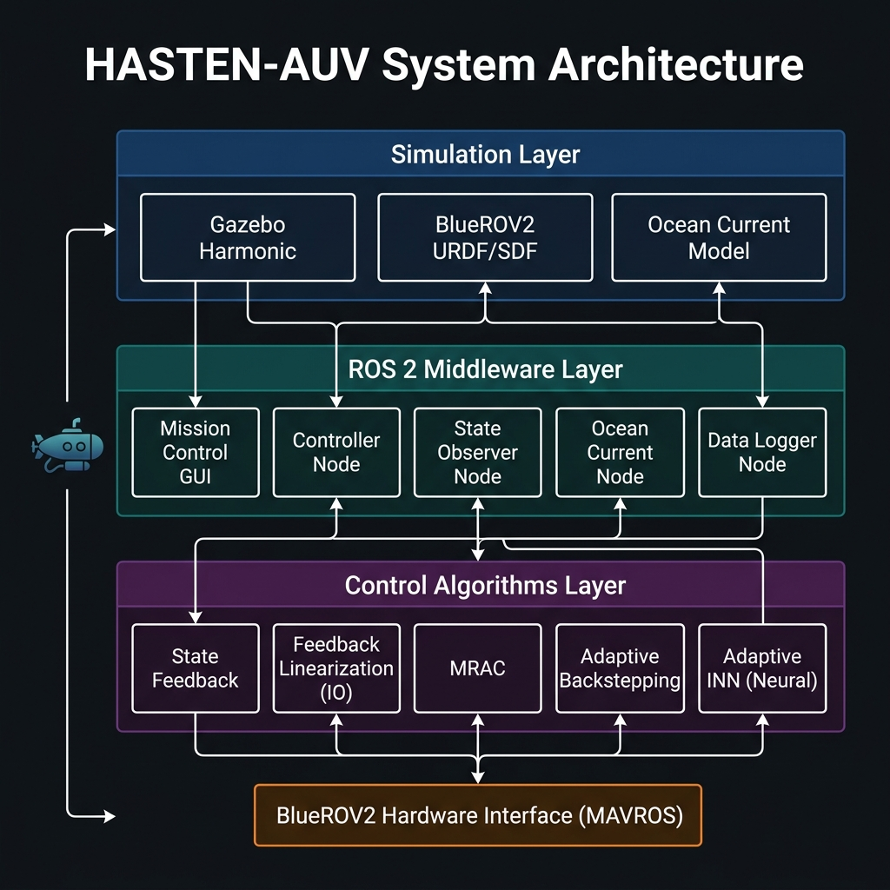

# HASTEN-AUV

> **H**aptic-shared **A**daptive con**S**ol **T**racking for **E**xperimental **N**avigation of **A**utonomous **U**nderwater **V**ehicles

HASTEN-AUV is a ROS 2-based underwater robotics project for adaptive nonlinear control, haptic shared control, and simulation of BlueROV2/AUV systems. Developed under the **TÜBİTAK 1002A** research programme, it provides a full simulation stack, a modular controller suite, and a GUI-based mission planner for comparative benchmarking of advanced control architectures.

[](https://docs.ros.org/en/humble/)
[](https://gazebosim.org/docs/harmonic/getstarted/)
[](https://www.docker.com/)
[](https://containers.dev/)
[](https://www.python.org/)
[](LICENSE)

---

## 📋 Overview

HASTEN-AUV integrates **Gazebo Harmonic** physics simulation with a **ROS 2 Humble** control stack to enable reproducible, publication-quality benchmarking of nonlinear underwater vehicle controllers. The project supports both software-in-the-loop (SITL) development via Docker Dev Containers and future real-hardware deployment through MAVROS.

Key research contributions:
- Comparative evaluation of five adaptive/nonlinear controllers on a 6-DOF AUV model
- Online backpropagation-trained Inverse Neural Network (INN) controller
- Haptic shared-control architecture for human-in-the-loop teleoperation
- Ocean current disturbance injection for robustness testing

---

## ✨ Features

| Feature | Details |
|---|---|
| 🤖 **ROS 2 Humble** | Full workspace with custom packages and launch files |
| 🐳 **Docker & Dev Container** | One-command reproducible environment |
| 🌊 **Gazebo Harmonic Simulation** | BlueROV2 URDF/SDF with hydrodynamics |
| 🧠 **5 Controller Architectures** | State Feedback → INN (see table below) |
| 📡 **Ocean Current Disturbance** | Configurable current node for robustness testing |
| 📊 **Automated Benchmarking** | CSV logging + RMSE/MSE/MAE/ITAE metrics |
| 🖥️ **Mission Control GUI** | Python-based trajectory planner and controller selector |
| 🔗 **MAVROS-Ready** | Hardware interface layer for real BlueROV2 deployment |

---

## 🏗️ System Architecture

```
┌─────────────────────────────────────────────────────────┐
│                    Simulation Layer                       │
│   Gazebo Harmonic │ BlueROV2 URDF/SDF │ Ocean Current   │
└──────────────────────────┬──────────────────────────────┘
                           │ ROS 2 Topics / Services
┌──────────────────────────▼──────────────────────────────┐
│                  ROS 2 Middleware Layer                   │
│  Mission GUI │ Controller Node │ Observer │ Data Logger  │
└──────────────────────────┬──────────────────────────────┘
                           │ Control Law τ
┌──────────────────────────▼──────────────────────────────┐
│                 Control Algorithms Layer                  │
│  State FB │ FL-IO │ MRAC │ Adaptive BS │ Adaptive INN   │
└──────────────────────────┬──────────────────────────────┘
                           │ MAVROS (hardware only)
                    BlueROV2 / ArduSub
```



---

## 📁 Repository Structure

```
hasten-auv/
├── ros2_ws/
│   └── src/
│       └── bluerov2_control/
│           ├── bluerov2_control/
│           │   ├── controller_node.py        # Main controller dispatcher
│           │   ├── state_observer_node.py    # EKF-based state observer
│           │   ├── ocean_current_node.py     # Disturbance injection
│           │   ├── data_logger_node.py       # CSV trajectory logger
│           │   ├── mission_control_gui.py    # Mission planner GUI
│           │   └── controllers/
│           │       ├── hasten_state_feedback.py
│           │       ├── hasten_fl_input.py
│           │       ├── hasten_fl_io.py        # ← Best performer
│           │       ├── hasten_mrac.py
│           │       ├── hasten_adaptive_backstepping.py
│           │       └── hasten_inn.py          # Adaptive Neural Controller
│           ├── launch/
│           │   ├── bluerov2_sim.launch.py
│           │   └── controllers.launch.py
│           ├── config/
│           │   └── controller_params.yaml
│           └── package.xml
├── results/
│   ├── metrics_summary.csv
│   └── plots/
├── .devcontainer/
│   ├── devcontainer.json
│   └── Dockerfile
├── docker-compose.yml
└── README.md
```

---

## 🚀 Quick Start

### Prerequisites

- Ubuntu 22.04 LTS
- [Docker Engine ≥ 24.0](https://docs.docker.com/engine/install/)
- [VS Code](https://code.visualstudio.com/) + [Dev Containers extension](https://marketplace.visualstudio.com/items?itemName=ms-vscode-remote.remote-containers)

> **Note:** No local ROS 2 or Gazebo installation required — everything runs inside the container.

---

### Option A — VS Code Dev Container (Recommended)

```bash
# 1. Clone the repository
git clone https://github.com/As0966/bluerov2_control_project.git
cd hasten-auv

# 2. Open in VS Code
code .

# 3. When prompted, click "Reopen in Container"
#    (or: Ctrl+Shift+P → "Dev Containers: Reopen in Container")
```

The container will automatically:
- Install ROS 2 Humble, Gazebo Harmonic, and all Python dependencies
- Build the ROS 2 workspace (`colcon build`)
- Source the workspace on every new terminal

---

### Option B — Docker Compose

```bash
git clone https://github.com/As0966/bluerov2_control_project.git
cd hasten-auv

# Start the simulation environment
docker-compose up --build

# In a new terminal, attach to the running container
docker exec -it hasten_auv_container bash
source /ros2_ws/install/setup.bash
```

---

### Option C — Native ROS 2 Install

```bash
# Requires: Ubuntu 22.04 + ROS 2 Humble + Gazebo Harmonic

git clone https://github.com/As0966/bluerov2_control_project.git
cd hasten-auv/ros2_ws

# Install dependencies
rosdep update
rosdep install --from-paths src --ignore-src -r -y

# Build
colcon build --symlink-install
source install/setup.bash
```

---

## 🎮 Running the Simulation

### 1. Launch the Full Stack

```bash
# Inside the container or sourced native environment:
ros2 launch bluerov2_control bluerov2_sim.launch.py
```

This starts: Gazebo Harmonic, Controller node, State observer, Ocean current node, Data logger.

### 2. Select a Controller

```bash
# At launch:
ros2 launch bluerov2_control bluerov2_sim.launch.py controller:=hasten_fl_io

# Hot-swap at runtime:
ros2 param set /controller_node controller hasten_inn
```

**Available controllers:**

| Parameter | Algorithm | Category |
|---|---|---|
| `hasten_state_feedback` | Linear State Feedback | Linear |
| `hasten_fl_input` | Input-State Feedback Linearization | Nonlinear |
| `hasten_fl_io` ⭐ | Input-Output Feedback Linearization | Nonlinear |
| `hasten_mrac` | Model Reference Adaptive Control | Adaptive |
| `hasten_adaptive_backstepping` | Adaptive Backstepping | Adaptive |
| `hasten_inn` | Adaptive Inverse Neural Network | Neural |

> ⭐ Best tracking performance across all trajectories.

### 3. Select a Trajectory

```bash
ros2 launch bluerov2_control bluerov2_sim.launch.py trajectory:=circle    # or figure8, spline
```

### 4. Mission Control GUI

```bash
ros2 run bluerov2_control mission_control_gui
```

Real-time controller selection, trajectory switching, disturbance injection, and live plotting.

---

## 🧠 Controller Details

### State Feedback
Linear control: `τ = −K·eₓ` where `eₓ` is the 8-state pose/velocity error. Baseline reference.

### Feedback Linearization — Input-Output (FL-IO)
Cascaded nonlinear cancellation: outer position loop computes `νd`, inner velocity loop computes `τ`. Best overall tracking.

### MRAC
Reference model `ν̇ₘ = aₘ·νₘ + bₘ·νd` with MIT-rule online adaptation to parameter uncertainty.

### Adaptive Backstepping
Regressor-matrix estimation of AUV mass/damping coefficients. Lyapunov-stable adaptive law.

### Adaptive INN (Inverse Neural Network)
Teacher-Student online learning framework:
- **Teacher**: Adaptive Backstepping controller
- **Student**: MLP updated via online backpropagation
- **Law**: `ΔW = −η ∇_W (½ ‖τ_BS − τ_INN‖²)`
- **Input**: `[eη, eν, νd, ν] ∈ ℝ¹⁶`

---

## 📊 Results

Benchmark across **circle**, **figure-8**, and **spline** trajectories:

| Controller | Trajectory | Pos RMSE (m) | Pos MAE (m) | ITAE | Ψ RMSE (rad) |
|---|---|---|---|---|---|
| **FL-IO** ⭐ | circle | **0.0357** | **0.0150** | **16.14** | 0.1160 |
| | figure-8 | **0.0294** | **0.0102** | **8.69** | 0.0550 |
| | spline | **0.0183** | **0.0071** | **7.45** | 0.0274 |
| **Backstepping** | circle | 0.0489 | 0.0398 | 62.96 | 0.1330 |
| | figure-8 | 0.0356 | 0.0233 | 32.11 | 0.0645 |
| | spline | 0.0255 | 0.0183 | 26.63 | 0.0307 |
| **Adaptive INN** | circle | 0.0507 | 0.0403 | 63.05 | 0.1353 |
| | figure-8 | 0.0390 | 0.0243 | 32.59 | 0.0660 |
| | spline | 0.0288 | 0.0200 | 28.28 | 0.0307 |
| **Adaptive BS** | circle | 0.0866 | 0.0750 | 117.37 | 0.1239 |
| **MRAC** | circle | 0.1709 | 0.1247 | 156.34 | 1.4142 |
| **State FB** | circle | 0.3276 | 0.3255 | 574.34 | 0.1780 |

Full results: [`results/metrics_summary.csv`](results/metrics_summary.csv)

> **Key finding:** IO Feedback Linearization achieves the lowest RMSE and ITAE across all trajectories. The Adaptive INN closely follows Backstepping, validating the teacher-student learning approach.

---

## 🛠️ Dev Container Configuration

```jsonc
// .devcontainer/devcontainer.json
{
  "name": "HASTEN-AUV",
  "build": { "dockerfile": "Dockerfile" },
  "runArgs": ["--network=host", "--privileged"],
  "mounts": ["source=${localWorkspaceFolder},target=/ros2_ws,type=bind"],
  "postCreateCommand": "cd /ros2_ws && colcon build --symlink-install",
  "customizations": {
    "vscode": {
      "extensions": ["ms-python.python", "ms-iot.vscode-ros", "ms-vscode.cmake-tools"]
    }
  }
}
```

```dockerfile
# .devcontainer/Dockerfile
FROM osrf/ros:humble-desktop-full
RUN apt-get update && apt-get install -y \
    gz-harmonic \
    python3-pip \
    ros-humble-mavros \
    ros-humble-mavros-extras \
  && pip3 install numpy scipy matplotlib
```

---

## 🤝 Contributing

1. Fork the repository
2. Create a feature branch: `git checkout -b feature/your-feature`
3. Commit with clear messages: `git commit -m "Add: feature description"`
4. Open a Pull Request

Bug reports → [Issues](../../issues)

---

## 📚 Citation

```bibtex
@misc{hasten_auv_2025,
  author       = {Bayisa Roba},
  title        = {HASTEN-AUV: Haptic-Shared Adaptive Control for Autonomous Underwater Vehicles},
  year         = {2025},
  publisher    = {GitHub},
  journal      = {GitHub repository},
  howpublished = {\url{https://github.com/As0966/bluerov2_control_project}},
  note         = {TÜBİTAK 1002A Research Project}
}
```

---

## 📄 License

MIT License — see [LICENSE](LICENSE).

---

## 🔗 References

- [BlueROV2 — Blue Robotics](https://bluerobotics.com/store/rov/bluerov2/)
- [ROS 2 Humble](https://docs.ros.org/en/humble/)
- [Gazebo Harmonic](https://gazebosim.org/docs/harmonic/getstarted/)
- [MAVROS](http://wiki.ros.org/mavros)
- Fossen, T. I. (2011). *Handbook of Marine Craft Hydrodynamics and Motion Control*. Wiley.

---

<div align="center">

**Built for underwater robotics research · TÜBİTAK 1002A**

[⭐ Star this repo](../../stargazers) · [🐛 Report a bug](../../issues) · [💡 Request a feature](../../issues)

</div>
